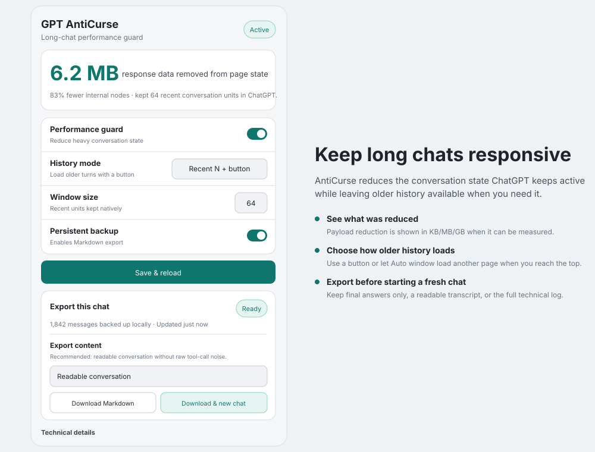
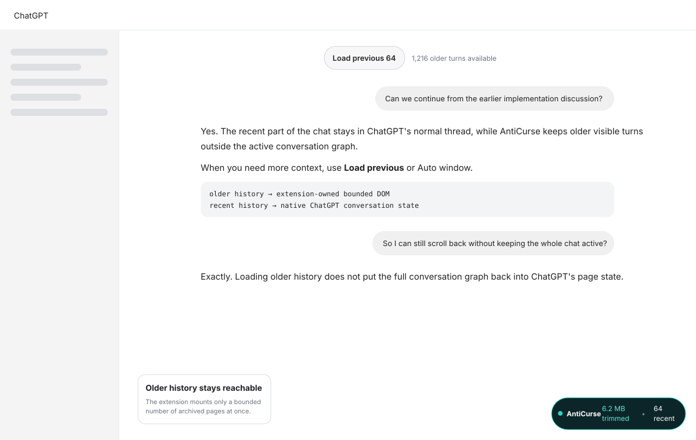
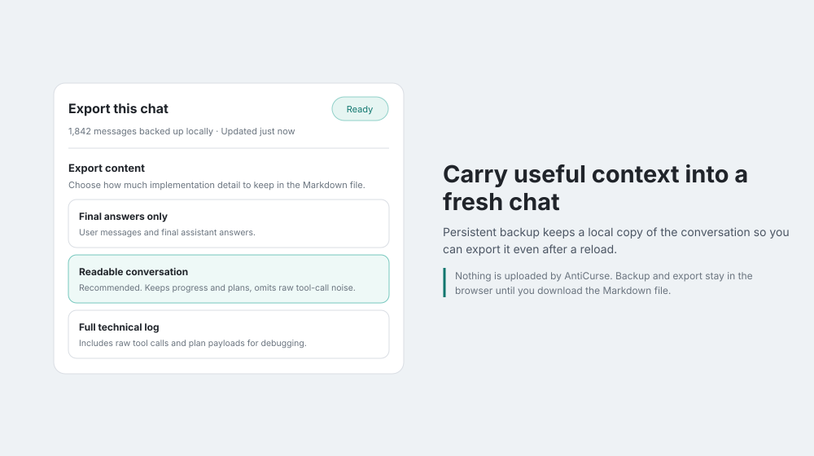

# GPT AntiCurse

Keep long ChatGPT conversations responsive without giving up older history.

[](https://github.com/mistrjirka/GPT-AntiCurse/releases/latest)
[](https://github.com/mistrjirka/GPT-AntiCurse/actions/workflows/release.yml)

Long ChatGPT threads can become slow because the page keeps a large conversation graph active. GPT AntiCurse reduces that active state, keeps a recent part of the conversation in ChatGPT's normal thread, and lets you load older visible history when you need it.

**It does not delete messages from your ChatGPT account.** AntiCurse changes what the current page keeps active, not the conversation stored by ChatGPT.



*Rendered preview with sample numbers. The values are illustrative, not benchmark results.*

## Install

Download the latest package from [GitHub Releases](https://github.com/mistrjirka/GPT-AntiCurse/releases/latest).

### Chrome and Chromium browsers

1. Download `gpt-anticurse-chrome-vX.Y.Z.zip` and extract it.
2. Open `chrome://extensions`.
3. Turn on **Developer mode**.
4. Click **Load unpacked**.
5. Select the extracted folder that contains `manifest.json`.
6. Open a ChatGPT conversation, click the AntiCurse icon, and press **Save & reload**.

Chrome can withhold site access from an extension. If AntiCurse shows **Needs access**, press **Save & reload** and allow access to `chatgpt.com`.

### Firefox desktop

The release contains a Firefox package. For temporary/manual installation:

1. Download `gpt-anticurse-firefox-vX.Y.Z.zip` and extract it.
2. Open `about:debugging#/runtime/this-firefox`.
3. Click **Load Temporary Add-on**.
4. Select `manifest.json` from the extracted folder.

The Firefox build targets Firefox 128 or newer. Stable Firefox normally requires add-ons to be signed for permanent installation.

### Firefox for Android

Starting with v0.6.4, the same Firefox package declares Android compatibility for AMO. Once the signed add-on is available through Firefox Add-ons, install it from Firefox for Android and open **Add-ons → GPT AntiCurse** from the browser menu.

The Android build uses the same response-filtering and history code as desktop Firefox, with narrower layouts and larger touch targets for the popup, status pill, and older-history controls.

For developer testing with an Android device connected over ADB, Mozilla's `web-ext` tooling can run the package with `web-ext run --target=firefox-android`.

## Use it

For most people, the defaults are a good starting point.

1. Open a long conversation on `chatgpt.com`.
2. Click the AntiCurse toolbar icon or open it from Firefox Android's **Add-ons** menu.
3. Leave **Performance guard** on.
4. Choose how older history should load:
   - **Recent N + button** keeps the latest window in ChatGPT and shows **Load previous** above it.
   - **Auto window** loads another older page when you reach the top.
5. Set **Window size** if you want more or less recent context kept in ChatGPT's normal thread.
6. Press **Save & reload** after changing the main settings.

### What the main number means

When AntiCurse can measure both versions of the conversation response, the popup shows the reduction in KB, MB, or GB. For example, **6.2 MB** means the transformed page state is 6.2 MB smaller than the original conversation response.

This is **not network bandwidth saved**: the response has already reached the browser. It is a measure of how much conversation data AntiCurse removes before ChatGPT's page code works with it.

If byte sizes are not available, AntiCurse shows the percentage of internal conversation nodes removed instead. Raw node counts, processing time, cumulative totals, and diagnostics are under **Technical details**.

## Older history stays available

AntiCurse does not put every older turn back into ChatGPT's active conversation state when you scroll upward. It renders older visible history in its own bounded history area and keeps only a small number of those archived pages mounted at once.



In **Recent N + button** mode, click **Load previous** to reveal another page. In **Auto window** mode, scroll to the top and AntiCurse loads the next page automatically.

## Backup and Markdown export

**Persistent backup** is optional. When enabled, AntiCurse keeps a local copy of the conversation in extension storage so it can still be exported after a reload.

The export menu has three useful levels:

- **Final answers only** — user messages and final assistant answers.
- **Readable conversation** — recommended for continuing work in a fresh chat; keeps useful progress and plans but omits raw tool-call noise.
- **Full technical log** — also includes raw tool calls and plan payloads for debugging or technical handoff.



A **Partial** backup can still be exported, but some older history may be missing. **Ready** means the stored archive is complete according to the data AntiCurse has seen.

## Privacy

AntiCurse runs locally in the browser.

- No telemetry or analytics.
- No remote extension code.
- AntiCurse does not upload your conversation to its own server.
- Persistent backups stay in browser extension storage.
- A Markdown file is created only when you choose to download one.
- Debug reports contain health information and diagnostics, not conversation text.

[Read the full privacy policy](PRIVACY.md).

## Troubleshooting

If AntiCurse is installed but does not seem to run, open the popup and press **Save & reload**. This is also useful after updating the extension because content scripts that were already loaded in a tab may still belong to the previous version.

If older history does not appear or the popup shows an error, open **Technical details**. **Download debug report** creates a local JSON report with extension state and recent diagnostics but no chat text. That report is useful when filing an issue.

If you see more than one AntiCurse status pill in the lower-right corner, update to the latest release and reload the tab. Current versions enforce a single status pill in the page DOM.

## Limits

- ChatGPT can change its page and response formats. AntiCurse fails open where possible: if it cannot safely transform a response, it keeps the original response rather than risking conversation data.
- Chromium has to intercept the page's response handling, so it depends more on ChatGPT page internals than the Firefox network-filter path.
- Firefox Android is declared compatible from v0.6.4, but physical-device behavior can still differ from desktop Firefox and should be reported if a mobile-only issue appears.
- Exported Markdown carries visible conversation context; it cannot reproduce a model's hidden state from the original chat.

<details>
<summary><strong>Development and architecture</strong></summary>

The extension uses plain JavaScript, CSS, and HTML with no bundler or minifier.

The trimming path is composed explicitly:

- `trim.js` provides the raw graph trimmer (`CGTrimCore`).
- `trim-logical.js` provides Recent-N logical budgeting (`CGTrimLogical`).
- `trim-pipeline.js` publishes the production `CGTrim` API.

History rendering is also composed from named modules: Markdown rendering, bounded virtualization, native-style fidelity, and hydration safety are combined once in `history-overlay.js`.

Firefox uses `webRequest.filterResponseData()` to transform conversation responses before the page consumes them. Chromium installs its response interceptor at `document_start` in the page's MAIN world; DOM, history, status, archive capture, and popup code stay in the isolated extension world.

Build both packages:

```bash
bash ./scripts/build.sh
```

Run the same unit/code-quality tests used by CI by following `.github/workflows/release.yml`. Release CI also runs real Chromium and Firefox extension E2E tests, including paging, Auto window, hydration-boundary behavior, and native-fidelity rendering.

</details>
